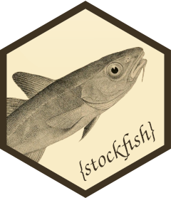

<!-- README.md is generated from README.Rmd. Please edit that file -->

# stockfish <a href='https://curso-r.com/'></a>

<!-- badges: start -->

[](https://CRAN.R-project.org/package=stockfish)
[](https://codecov.io/gh/curso-r/stockfish?branch=master)
[](https://github.com/curso-r/stockfish/actions)
<!-- badges: end -->

## Overview

`{stockfish}` is an R package that implements the
[UCI](http://wbec-ridderkerk.nl/html/UCIProtocol.html) open
communication protocol and ships with
[Stockfish](https://github.com/official-stockfish/Stockfish), a very
popular, open source, powerful chess engine written in C++.

## Installation

Install the released version of `{stockfish}` from CRAN:

``` r
install.packages("stockfish")
```

Or install the development version from
[GitHub](https://github.com/curso-r/stockfish):

``` r
# install.packages("remotes")
remotes::install_github("curso-r/stockfish")
```

You can also find more (and more recent) versions of the Stockfish
engine to use with `{stockfish}` at their [download
page](https://stockfishchess.org/download/).

## Example

`{stockfish}` is as simple to use as any other UCI package. You should
start the engine with `fish$new()` and send commands with its internal
methods, only remembering to run `quit()` once you’re done.

``` r
library(stockfish)

# Start the engine
engine <- fish$new()

# Examine background process
engine$process
#> PROCESS 'stockfish', running, pid 49842.

# Search for best move
engine$go()
#> [1] "info depth 14 seldepth 19 multipv 1 score cp 56 nodes 420525 nps 274673 hashfull 184 tbhits 0 time 1531 pv e2e4 e7e5 g1f3 g8f6 d2d4 f6e4 f3e5 d8e7 d1e2 e4f6 e5f3 b8c6 e2e7 f8e7"

# Setup a game from FEN
engine$ucinewgame()
engine$position("6rk/2Q3p1/5qBp/5P2/8/7P/6PK/8 w - - 15 51")
engine$go()
#> [1] "info depth 17 currmove d2d4 currmovenumber 4"

# Stop the engine
engine$quit()
```

## Usage

`fish`, this package’s main class, represents a Stockfish engine,
allowing the user to send commands and receive outputs according to the
UCI protocol. In short, a `fish` object, when created, spawns a detached
Stockfish process and pipes into its stdin and stdout.

For more information, see its full documentation by running `?fish`.

### Bundled Stockfish

This package comes bundled with
[Stockfish](https://github.com/official-stockfish/Stockfish), a very
popular, open source, powerful chess engine written in C++. It can
achieve an ELO of 3544, runs on Windows, macOS, Linux, iOS and Android,
and can be compiled in less than a minute.

When installing `{stockfish}` (lower case), Stockfish’s (upper case)
source code is compiled and the resulting executable is stored with your
R packages. This is not a system-wide installation! You don’t have to
give it administrative privileges to run or even worry about any
additional software.

But there are two main downsides:

1.  While the bundled version of the engine (Stockfish 14.1) is
    up-to-date as of March 2022, it isn’t able to update itself. This
    means that, if I’m not able to port an upcomming version of
    Stockfish, the package will stay behind. Luckly, you can always
    [download](https://stockfishchess.org/download/) the version of your
    choosing and pass the executable as an argument to `fish$new()`.

2.  Since version 12, Stockfish supports [NNUE
    evaluation](https://github.com/official-stockfish/Stockfish#a-note-on-classical-evaluation-versus-nnue-evaluation),
    but this requires some pretty heavy binaries. In order to avoid
    bundling large files with `{stockfish}`, **I have decided to disable
    NNUE** in the source code. Again, you are free to
    [download](https://stockfishchess.org/download/) a NNUE-capable
    version and use it instead of the bundled executable.

### UCI Protocol

UCI (Universal Chess Interface) is an open communication protocol that
enables chess engines to communicate with user interfaces. Strictly
speaking, the `fish` class implements the [UCI
protocol](http://wbec-ridderkerk.nl/html/UCIProtocol.html) as publicized
by Stefan-Meyer Kahlen, just with a focus on the Stockfish engine. This
means that some methods are not implemented (see **Common Gotchas**) and
that all tests are run on Stockfish, but everything else should work
fine with other engines.

The quoted text at the end of the documentation of each method was
extracted directly from the official UCI protocol, so you can see
exactly what that command can do. In general, the commands are pretty
self-explanatory, except for long algebraic notation (LAN), the move
notation used by UCI. In this notation, moves are recorded using the
starting and ending positions of each piece, e.g. e2e4, e7e5, e1g1
(white short castling), e7e8q (for promotion), 0000 (nullmove).

### Implementation

All the heavy lifting of the `fish` class is done by the `{processx}`
package. The Stockfish process is created with `processx::process$new`
and IO is done with `write_input()` and `read_output()`. An important
aspect of the communication protocol of any UCI engine is waiting for
replies, and here this is done with a loop that queries the process with
`poll_io()` and stops once the output comes back empty.

Before implementing the UCI protocol manually, this package used
`{bigchess}`. It is a great package created by
[@rosawojciech](https://github.com/rosawojciech), but it has some
dependencies that are beyond the scope of this package and ultimately I
wanted more control over the API (e.g. using `{R6}`).

### Common Gotchas

The `fish` class has some specifics that the user should keep in mind
when trying to communicate with Stockfish. Some of them are due to
implementation choices, but others are related to the UCI protocol
itself. This is by no means a comprehensive list (and you should
probably read [UCI’s
documentation](http://wbec-ridderkerk.nl/html/UCIProtocol.html)), but
here are a few things to look out for:

-   Not every UCI method is implemented: since `{stockfish}` was made
    with Stockfish in mind, a couple of UCI methods that don’t work with
    the engine were not implemented. They are `debug()` and
    `register()`.

-   Most methods return silently: since most UCI commands don’t output
    anything or output boilerplate text, most methods return silently.
    The exceptions are `run()`, `isready()`, `go()` and `stop()`; you
    can see exactly what they return by reading their documentations.

-   Not every Stockfish option will work: at least when using the
    bundled version of Stockfish, not every documented option will work
    with `setoption()`. This happens because, as described above, the
    bundled version has some limitations. Options that will not work are
    labeled with an asterisk.

-   Times are in milliseconds: unlike most R functions, every method
    that takes a time interval expects them in milliseconds, not
    seconds.

## Code of Conduct

Please note that the `{stockfish}` project is released with a
[Contributor Code of
Conduct](https://contributor-covenant.org/version/2/0/CODE_OF_CONDUCT.html).
By contributing to this project, you agree to abide by its terms.

## Copyright Notice

The [C++ code](https://github.com/curso-r/stockfish/tree/master/src) of
the `{stockfish}` project is derived from [Stockfish
14.1](https://github.com/official-stockfish/Stockfish/releases/tag/sf_14.1),
and its main authors are listed as contributors in the
[DESCRIPTION](https://github.com/curso-r/stockfish/blob/master/DESCRIPTION)
file. For a full list of Stockfish 14.1’s authors, please see their
[AUTHORS](https://github.com/official-stockfish/Stockfish/blob/7262fd5d14810b7b495b5038e348a448fda1bcc3/AUTHORS)
list. Finally, as per Stockfish’s terms of use, `{stockfish}` is also
licensed under the GPL 3 (or any later version at your option). Check
out
[LICENSE.md](https://github.com/curso-r/stockfish/blob/master/LICENSE.md)
for the full text.
